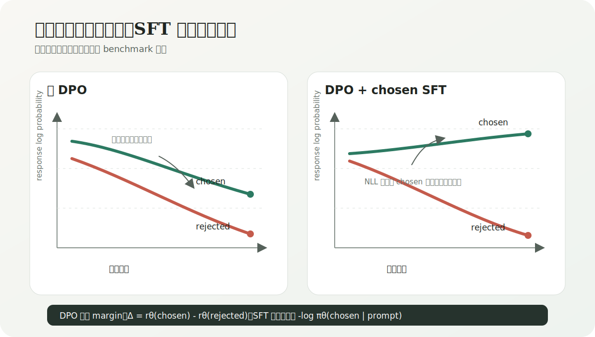
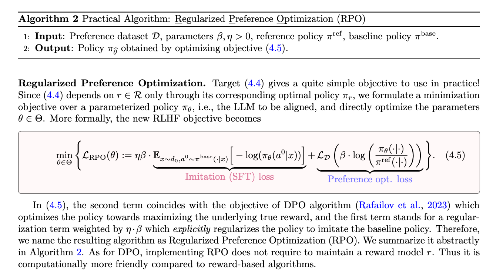
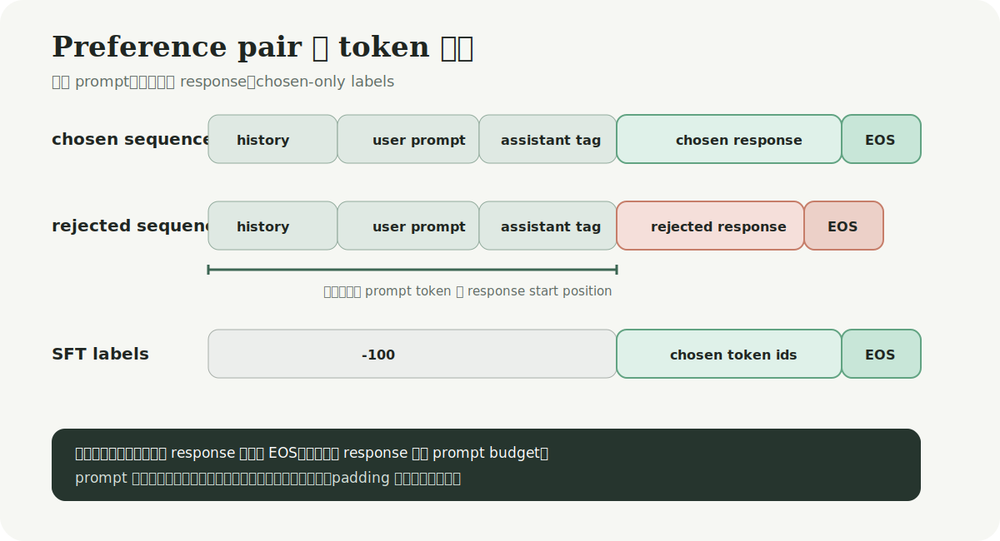
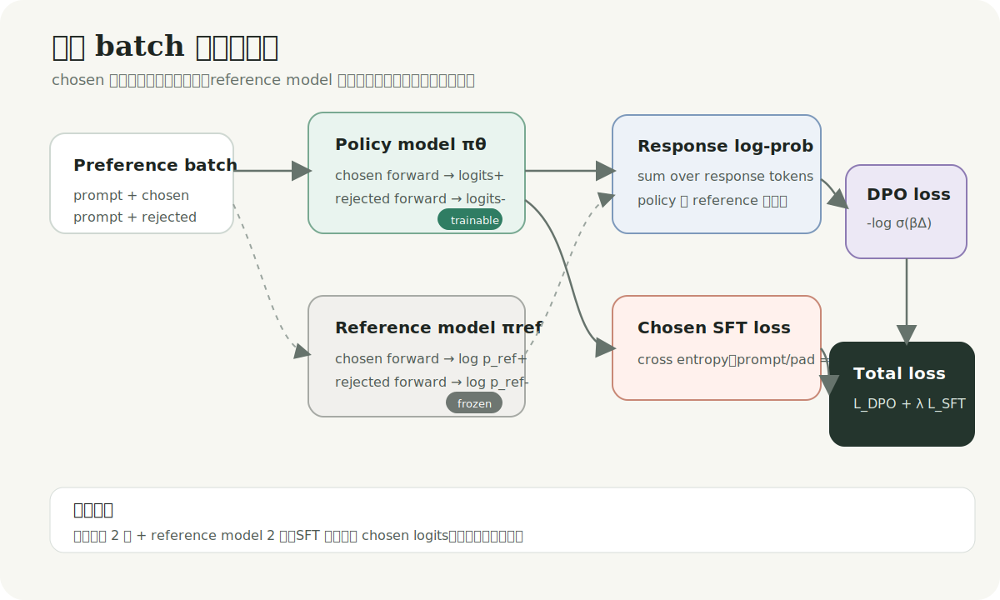

# 在 DPO 中保留一条 SFT 梯度：从相对偏好到 chosen likelihood 锚定

> 本文讨论一种直接的联合训练目标：在标准 DPO loss 上叠加 chosen response 的 response-only SFT loss。重点不在提出新算法，而在解释这条额外梯度解决了什么、实现时哪些细节会改变目标，以及怎样设计实验判断它是否真的有效。

## 1. 问题界定

DPO 优化的是同一 prompt 下 chosen 与 rejected response 的相对优势。只要两者的 reward margin 扩大，loss 就会下降。这个目标没有要求 chosen response 的绝对似然必须上升。

该性质并非只存在于推导里。DPO-Positive 的作者分析了 preference pair 差异较小时 preferred likelihood 下降的问题；后续工作将更一般的现象称为 likelihood displacement：chosen 与 rejected 的 log probability 可以同时降低，概率质量则转移到训练 pair 之外的输出上。安全对齐实验里，这种转移甚至会降低模型的拒答率。[Pal et al., 2024](https://arxiv.org/abs/2402.13228)；[Razin et al., 2024](https://arxiv.org/abs/2410.08847)

在 DPO loss 上加入 chosen-response NLL，是一种朴素但可解释的处理：DPO 继续学习「谁更好」，SFT 项要求策略模型不要离高质量 chosen response 太远。它给相对目标增加了一个绝对锚点。



上图是机制示意，不是训练曲线。联合目标是否改善最终生成质量，仍需在固定数据、解码参数和评测协议下验证。

## 2. 标准 DPO 目标只关心相对差值

设 prompt 为 $x$，chosen response 为 $y^+$，rejected response 为 $y^-$。策略模型和 reference model 分别记为 $\pi_\theta$ 与 $\pi_{\text{ref}}$。response 的序列 log probability 是 token 条件概率之和：

```math
\log \pi_\theta(y\mid x)
=
\sum_{t=1}^{|y|}
\log \pi_\theta(y_t\mid x,y_{\lt t})
```

项目采用标准 sigmoid DPO 形式。先定义 reference-adjusted score：

```math
s_\theta(x,y)
=
\log \pi_\theta(y\mid x)
-
\log \pi_{\text{ref}}(y\mid x)
```

一个 preference pair 的 margin 与 loss 为：

```math
\Delta_\theta
=
s_\theta(x,y^+)-s_\theta(x,y^-)
```

```math
\mathcal{L}_{\text{DPO}}
=
-\log \sigma(\beta\Delta_\theta)
```

这与 DPO 原论文从 KL-regularized RLHF 推导出的二分类目标一致。[Rafailov et al., 2023](https://arxiv.org/abs/2305.18290)

关键点在 $\Delta_\theta$。如果 chosen score 从 $-1$ 变为 $-2$，rejected score 从 $-2$ 变为 $-5$，margin 仍从 $1$ 增加到 $3$。DPO 会认为优化方向正确，尽管 chosen score 下降了。对 preference ranking 而言，这不构成逻辑矛盾；当 chosen 本身是希望模型模仿的高质量答案时，问题才出现。

$\beta$ 也不能替代 chosen likelihood 锚点。它缩放 preference margin，影响单个样本的梯度强度与策略偏离 reference 的程度，却没有给 chosen response 单独增加绝对约束。

## 3. 联合目标与梯度含义

chosen-response SFT loss 只监督 response token 和 EOS，不计算 prompt 与 padding：

```math
\mathcal{L}_{\text{SFT}}
=
-\frac{1}{T_+}
\sum_{t=1}^{T_+}
\log \pi_\theta(y_t^+\mid x,y_{\lt t}^+)
```

联合目标为：

```math
\mathcal{L}_{\text{total}}
=
\mathcal{L}_{\text{DPO}}
+
\lambda_{\text{SFT}}\mathcal{L}_{\text{SFT}}
```

两项 loss 对 chosen response 的作用并不重复。DPO 梯度取决于 chosen 与 rejected 的差值；SFT 梯度直接提高数据中 chosen token 的条件概率。用梯度写得更清楚：

```math
\nabla_\theta \mathcal{L}_{\text{total}}
=
\nabla_\theta \mathcal{L}_{\text{DPO}}
+
\lambda_{\text{SFT}}
\nabla_\theta \mathcal{L}_{\text{SFT}}
```

$\beta$ 与 $\lambda_{\text{SFT}}$ 因此承担不同职责：前者调节 preference margin 的尺度，后者调节 chosen imitation 的强度。把两者同时固定为 $0.1$ 只是一个起始配置，不能据此认为它们具有相同量纲或相同敏感性。

该目标与 Regularized Preference Optimization 的实用形式相近。Liu 等人从离线偏好数据的 distribution shift 与 overoptimization 出发，将 preference optimization loss 和 baseline-policy imitation loss 写入同一目标；当 baseline 分布取 preference 数据中的 chosen response 时，imitation 项就对应 chosen NLL。[Liu et al., 2024](https://arxiv.org/abs/2405.16436)



*图：Regularized Preference Optimization 的 Algorithm 2 与 Equation (4.5) 截图。来源：[Liu et al., 2024, arXiv:2405.16436](https://arxiv.org/abs/2405.16436)。截图用于说明目标结构，不代表本文项目复现了该论文的实验结论。*

### 3.1 与几种相邻方法的区别

| 方法 | preference 项 | chosen 绝对约束 | reference model | 与本文实现的关系 |
| --- | --- | --- | --- | --- |
| 标准 DPO | reference-adjusted log-ratio | 无 | 需要 | $\lambda_{\text{SFT}}=0$ 时退化到该目标 |
| Regularized Preference Optimization | DPO 类目标 | SFT / imitation loss | 需要 | 目标结构最接近，但实验协议并未复现 |
| Iterative Reasoning Preference Optimization | modified DPO | winning reasoning NLL | 需要 | 同样加入 NLL，场景是迭代 CoT 训练 |
| DPO-Positive | DPO 的正样本 penalty | chosen 低于 reference 时触发 | 需要 | 动机相近，penalty 形式不同 |
| ORPO | odds-ratio loss | SFT loss | 不需要 | 同为联合目标，但并非 DPO + SFT |

这里需要特别注意 RPO 重名问题。Pang 等人的 Iterative Reasoning Preference Optimization 也在 modified DPO 中加入 NLL，并报告该项对迭代推理训练很重要；这项证据来自 CoT 数据与迭代采样，不能直接外推到通用 instruction preference 数据。[Pang et al., 2024](https://arxiv.org/abs/2404.19733)

ORPO 的目标写作 $\mathcal{L}_{\text{SFT}}+\lambda\mathcal{L}_{\text{OR}}$，preference 项使用 odds ratio，而且不保留 reference model。将本文实现称为 ORPO 会混淆目标形式和计算成本。[Hong et al., 2024](https://arxiv.org/abs/2403.07691)

## 4. 数据构造决定了 loss 到底在学什么

联合 loss 的公式不复杂，数据边界更容易出错。一个 preference record 至少需要 prompt、chosen 和 rejected：

```json
{
  "instruction": "解释 DPO 的训练目标。",
  "input": "区分策略模型和参考模型。",
  "chosen": "DPO 比较策略模型与参考模型在偏好对上的对数概率差。",
  "rejected": "DPO 等同于普通的语言模型预训练。",
  "history": [
    ["什么是偏好数据？", "它为同一输入提供更优与较差的回答。"]
  ]
}
```

### 4.1 chosen 与 rejected 必须共享同一份 prompt token

文本相同不代表 token 序列必然相同。chat template、generation prompt、截断位置只要有一项不同，pairwise margin 就会混入 prompt 差异。实现中先渲染一次 prompt，再将同一组 token 分别拼接 chosen 和 rejected response。



截断顺序也需要固定：

1. 分别编码 chosen 与 rejected response，并追加 EOS。
2. response 超长时从右侧截断，最后一个位置仍保留 EOS。
3. 以 pair 中较长 response 计算 prompt budget。
4. prompt 超长时从左侧截断，chosen 与 rejected 复用相同结果。

这套策略优先保留靠近当前回答的上下文，并保证两侧 response start position 一致。代价是很早的 system message 或历史信息可能被截掉。若任务依赖长 system prompt，应该单独统计该字段的保留率，不能只看总序列长度。

### 4.2 SFT labels 只能覆盖 chosen response

prompt token 和 padding 的 label 设为 `-100`，chosen response 与 EOS 保留真实 token id。否则 SFT 项会同时拟合 prompt，loss 大小也会随 prompt 长度变化，和「chosen-response 锚点」的原始设计不再一致。

rejected response 不应进入 SFT labels。它在联合目标里只通过 DPO 分支提供相对信号。

### 4.3 summed log-probability 带来长度敏感性

项目使用 response token log probability 的总和，不做长度归一化：

```math
\log \pi_\theta(y\mid x)=\sum_t \log p_t
```

由于每个 token 的 log probability 通常为负，长 response 的序列分数天然更低。reference-adjusted ratio 能抵消一部分长度影响，但数据中的 chosen/rejected 长度相关性仍可能进入 preference signal。示例数据若总是「chosen 更详细、rejected 更短」，模型可能学到 verbosity，而非答案质量。

最低限度的审计应包含：

- chosen 与 rejected 的 token 数分布及差值分布；
- preference label 与长度差的相关性；
- 按长度差分桶后的 DPO accuracy；
- 生成结果的平均长度与 length-controlled win rate。

LD-DPO 将 verbosity bias 作为独立问题处理，并报告了明显的长度变化。这说明加入 SFT loss 不会自动消除长度偏差。[Liu et al., 2024](https://arxiv.org/abs/2409.06411)

## 5. 单批次计算实现

response log probability 的实现需要处理 causal shift、padding mask 和 response 起点。下面的代码块是独立示例，不依赖特定训练框架：

```python
import torch
import torch.nn.functional as F


def response_logps(
    logits: torch.Tensor,
    input_ids: torch.Tensor,
    attention_mask: torch.Tensor,
    response_start_positions: torch.Tensor
) -> torch.Tensor:
    """Sum response-token log probabilities for each sequence.

    Args:
        logits: Causal LM logits with shape batch by sequence by vocabulary.
        input_ids: Token IDs with shape batch by sequence.
        attention_mask: Non-padding mask with shape batch by sequence.
        response_start_positions: First response position in shifted logits.

    Returns:
        Summed response log probability for every sequence.
    """
    shifted_logps = F.log_softmax(logits, dim = -1)[:, :-1, :]
    shifted_labels = input_ids[:, 1:]
    shifted_attention = attention_mask[:, 1:].bool()
    token_logps = torch.gather(shifted_logps, dim = -1, index = shifted_labels.unsqueeze(-1)).squeeze(-1)

    positions = torch.arange(token_logps.shape[1], device = token_logps.device)
    response_mask = positions.unsqueeze(0) >= response_start_positions.unsqueeze(1)
    final_mask = shifted_attention & response_mask

    return (token_logps * final_mask).sum(dim = -1)
```

如果 prompt 长度为 $P$，第一个 response token 位于 `input_ids[P]`，预测它的 logits 位于 shift 后的索引 $P-1$。因此 `response_start_positions` 应设为 `len(prompt_ids) - 1`。这里的 off-by-one 错误不会必然触发 shape exception，却会漏算第一个 response token，单元测试需要显式覆盖。

联合 loss 可以压缩为以下计算：

```python
import torch
import torch.nn.functional as F


def joint_preference_loss(
    policy_chosen_logps: torch.Tensor,
    policy_rejected_logps: torch.Tensor,
    reference_chosen_logps: torch.Tensor,
    reference_rejected_logps: torch.Tensor,
    chosen_logits: torch.Tensor,
    chosen_labels: torch.Tensor,
    beta: float = 0.1,
    sft_weight: float = 0.1
) -> tuple[torch.Tensor, dict[str, torch.Tensor]]:
    """Combine sigmoid DPO loss with chosen-response SFT loss.

    Args:
        policy_chosen_logps: Policy sequence log probabilities for chosen responses.
        policy_rejected_logps: Policy sequence log probabilities for rejected responses.
        reference_chosen_logps: Reference sequence log probabilities for chosen responses.
        reference_rejected_logps: Reference sequence log probabilities for rejected responses.
        chosen_logits: Policy logits from the chosen forward pass.
        chosen_labels: Chosen labels with prompt and padding set to -100.
        beta: Scale applied to the reference-adjusted preference margin.
        sft_weight: Weight applied to chosen-response SFT loss.

    Returns:
        Total loss and detached component metrics.
    """
    chosen_reward = policy_chosen_logps - reference_chosen_logps
    rejected_reward = policy_rejected_logps - reference_rejected_logps
    dpo_logits = beta * (chosen_reward - rejected_reward)
    dpo_loss = -F.logsigmoid(dpo_logits).mean()

    shifted_logits = chosen_logits[:, :-1, :].contiguous()
    shifted_labels = chosen_labels[:, 1:].contiguous()
    sft_loss = F.cross_entropy(shifted_logits.view(-1, shifted_logits.shape[-1]), shifted_labels.view(-1), ignore_index = -100)
    total_loss = dpo_loss + sft_weight * sft_loss

    metrics = {"dpo_loss": dpo_loss.detach(), "sft_loss": sft_loss.detach(), "total_loss": total_loss.detach()}
    return total_loss, metrics
```

chosen 的策略前向结果同时用于两条分支：sequence log probability 进入 DPO，token logits 进入 SFT。额外的 SFT 项不需要再跑一次模型前向。



每个 batch 仍需要四次模型前向：策略模型的 chosen/rejected 各一次，reference model 的 chosen/rejected 各一次。reference model 被设为 evaluation mode、关闭梯度并保持参数固定，但完整权重仍占显存。数据集固定时，可以预计算 reference log probability；TRL 也提供了对应选项，用计算前置换取训练阶段显存。[Hugging Face TRL DPOTrainer](https://huggingface.co/docs/trl/dpo_trainer)

## 6. 指标：哪些数字能说明问题，哪些不能

联合训练至少需要拆分记录以下量：

| 指标 | 定义 | 能说明什么 | 不能说明什么 |
| --- | --- | --- | --- |
| `dpo_loss` | $-\log\sigma(\beta\Delta)$ | preference margin 是否继续被优化 | 生成质量是否提升 |
| `dpo_accuracy` | $s_\theta(y^+)\gt s_\theta(y^-)$ 的比例 | reference-adjusted pair 排序 | held-out prompt 上的真实 win rate |
| `sft_loss` | chosen response token CE | 模型对 chosen token 的拟合程度 | preference 区分能力 |
| `policy_diff_mean` | $\log\pi_\theta(y^+)-\log\pi_\theta(y^-)$ | 策略模型的原始 pair gap | 相对 reference 的变化 |
| `reference_diff_mean` | reference model 的原始 pair gap | 初始模型是否已偏向 chosen | 当前策略是否过拟合 |
| `chosen_logratio_mean` | $\log\pi_\theta(y^+)-\log\pi_{\text{ref}}(y^+)$ | chosen 相对 reference 的变化 | 严格 KL divergence |
| `rejected_logratio_mean` | rejected 的同类 log-ratio | rejected 是否被相对压低 | 严格 KL divergence |

最后两项常被实现命名为 `kl_chosen` 与 `kl_rejected`，但单个已观测 response 上的 log-ratio 不是严格 KL。KL 需要对某个分布下的输出求期望。指标名称如果不改，日志说明中至少要写清这一点。

只看 `dpo_accuracy` 尤其危险。chosen 与 rejected 同时下降时，排序仍可达到 100%。更可靠的监控组合包括：

- chosen/rejected 的策略 log probability 与 reference log probability；
- preference margin、SFT loss 和总 loss；
- chosen/rejected token 数、生成长度和截断率；
- held-out preference accuracy 与固定 judge 的 win rate；
- 固定 prompt 集上的真实生成，而非 teacher-forced log probability。

13 项离线测试可以确认数据对齐、mask、EOS、loss 可微和一步训练循环没有断裂。这类测试很必要，但它们只能验证实现约束，不能替代真实 preference 数据上的实验。

## 7. $\lambda_{\text{SFT}}$ 的实验设计

$\lambda_{\text{SFT}}$ 越大，训练越接近 chosen-only SFT；越小，行为越接近标准 DPO。合理的初始消融不应只比较 $0$ 与 $0.1$，建议至少覆盖：

```math
\lambda_{\text{SFT}}
\in
\{0, 0.01, 0.05, 0.1, 0.25, 0.5\}
```

实验中固定模型初始化、preference split、batch size、优化器、训练步数、$\beta$ 和解码配置。每个设置至少保存相同 training step 的 checkpoint，避免一个配置按 epoch 比较、另一个按 step 比较。

我会用四组判据决定 SFT 项是否值得保留：

1. chosen log-ratio 是否不再持续下降，同时 rejected log-ratio 仍有区分度；
2. held-out preference 与 generation win rate 是否共同改善，而非只降低 teacher-forced SFT loss；
3. 输出长度、重复率和拒答率是否发生非预期漂移；
4. 不同随机种子下的变化是否大于评测噪声。

若 $\lambda_{\text{SFT}}$ 增大后 SFT loss 下降、pairwise accuracy 却停滞，说明 imitation 梯度压过了 preference signal。相反，如果 preference margin 持续增大而 chosen log-ratio 长期下降，当前权重不足以提供有效锚定。两种情况都不能通过单看 total loss 识别。

## 8. 当前实现的边界

这套训练器已经覆盖联合目标所需的主要路径：response-only mask、共享 prompt、固定 reference model、动态 padding、LoRA/QLoRA 接入，以及分量日志。但仍有几项边界需要在真实训练前处理。

第一，reference model 常驻显存。LoRA 只减少策略模型的可训练参数，不会自动消除 reference 权重。显存紧张时，优先考虑预计算 reference log probability、分布式切分或安全的 offload。

第二，当前序列分数不做长度归一化。偏好数据若有强长度偏差，应先审计数据，再决定使用 length-controlled evaluation、pair reweighting 或 LD-DPO 类目标。不要把长度问题交给 $\lambda_{\text{SFT}}$ 顺手解决。

第三，chosen SFT 项依赖 chosen 确实可被模仿。如果 preference pair 只表达「二者中相对更好」，chosen 本身仍包含事实错误或风格缺陷，NLL 会把这些缺陷当作绝对监督。数据过滤的重要性因此高于调一个更精细的 loss weight。

第四，SFT 正则不是完备修复。χPO 的理论分析给出了 DPO + SFT 仍可能失败的构造；DPO-Positive 和 likelihood displacement 的研究也表明，pair 相似度、未覆盖输出与函数逼近都会影响概率质量转移。[Huang et al., 2024](https://arxiv.org/abs/2407.13399)

第五，策略模型在训练模式下执行 chosen/rejected 两次前向。如果 LoRA dropout 或模型内部 dropout 保持开启，两侧 sequence log probability 会受到不同随机 mask 的影响，preference margin 因而多一层方差。TRL 的 DPO 配置默认关闭 policy 与 reference 的 dropout；本实现若保留 `lora_dropout = 0.1`，应通过对照实验判断这部分随机性是否可接受。

第六，QLoRA 只减少策略模型基座的权重显存，不代表 reference model 也被量化。若 reference 仍按 FP16、BF16 或 FP32 加载，它可能成为显存占用的主要部分。训练前应分别记录 policy、adapter、optimizer state 和 reference 的显存，而不是从「启用了 4-bit」直接推断整条 DPO 链路都按 4-bit 存储。

## 9. 结论

在 DPO 上叠加 chosen-response SFT loss，最准确的描述是「给相对偏好目标增加一条 imitation 梯度」。它不改变 preference pair 的基本结构，也不需要额外的策略模型前向；它改变的是 chosen response 的绝对优化方向。

该设计值得验证，因为标准 DPO 确实允许 chosen likelihood 下降，相关工作也给出了理论分析与实验证据。但是否应该保留这条梯度，最终取决于三件可测量的事：chosen 数据是否足够可靠、likelihood displacement 是否真实出现，以及生成质量能否在控制长度和评测噪声后改善。

下一步不是继续增加 loss 组件，而是跑完 $\lambda_{\text{SFT}}$ 消融，并把 chosen/rejected 的绝对 log probability、长度分布和 held-out generation 结果放在同一张图里。只有这组证据齐全，联合目标才从合理的工程假设变成项目结论。

## 参考资料

1. Rafael Rafailov et al. [Direct Preference Optimization: Your Language Model is Secretly a Reward Model](https://arxiv.org/abs/2305.18290), 2023.
2. Zhihan Liu et al. [Provably Mitigating Overoptimization in RLHF: Your SFT Loss is Implicitly an Adversarial Regularizer](https://arxiv.org/abs/2405.16436), 2024.
3. Richard Yuanzhe Pang et al. [Iterative Reasoning Preference Optimization](https://arxiv.org/abs/2404.19733), 2024.
4. Arka Pal et al. [Smaug: Fixing Failure Modes of Preference Optimisation with DPO-Positive](https://arxiv.org/abs/2402.13228), 2024.
5. Noam Razin et al. [Unintentional Unalignment: Likelihood Displacement in Direct Preference Optimization](https://arxiv.org/abs/2410.08847), 2024.
6. Jiwoo Hong et al. [ORPO: Monolithic Preference Optimization without Reference Model](https://arxiv.org/abs/2403.07691), 2024.
7. Wei Liu et al. [Length Desensitization in Direct Preference Optimization](https://arxiv.org/abs/2409.06411), 2024.
8. Audrey Huang et al. [Correcting the Mythos of KL-Regularization: Direct Alignment without Overoptimization via χ²-Preference Optimization](https://arxiv.org/abs/2407.13399), 2024.
9. Hugging Face. [TRL DPOTrainer documentation](https://huggingface.co/docs/trl/dpo_trainer).
